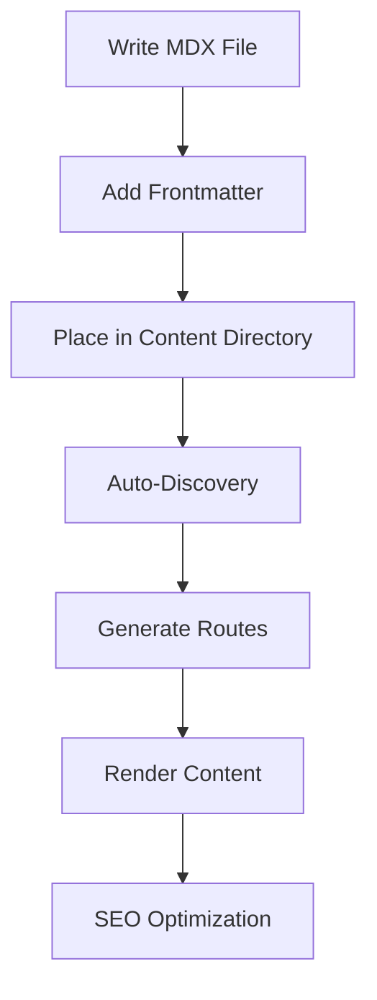

# Complete MDX Tutorial Template

Welcome to the **ultimate MDX tutorial template**! This document showcases every feature, component, and styling capability available in our AI Learning Hub platform.

<Badge variant="default">Featured Content</Badge> <Badge variant="secondary">New</Badge> <Badge variant="outline">Tutorial</Badge>

## Table of Contents

1. [Basic Typography](#basic-typography)
2. [Code Examples](#code-examples)
3. [Custom Components](#custom-components)
4. [Lists and Tables](#lists-and-tables)
5. [Interactive Elements](#interactive-elements)
6. [Advanced Features](#advanced-features)

---

## Basic Typography

### Headings Showcase

# This is an H1 Heading
## This is an H2 Heading  
### This is an H3 Heading

### Text Formatting

Here's a paragraph with **bold text**, *italic text*, and `inline code`. You can also use ~~strikethrough text~~ and combine ***bold italic*** formatting.

> This is a blockquote that demonstrates how quoted content appears. It's perfect for highlighting important information, tips, or quotes from experts.

### Links and References

You can create [internal links](/howto) to other pages, [external links](https://github.com) to websites, and reference anchors within the document like [Basic Typography](#basic-typography).

---

## Code Examples

### Inline Code

Use `npm install` to install packages, or reference variables like `process.env.NODE_ENV`.

### Code Blocks with Syntax Highlighting

Here's a JavaScript example:

```javascript
// Example: AI-powered content discovery
async function getContentItems(category) {
  const files = await fs.readdir(`./content/${category}`);
  const items = await Promise.all(
    files
      .filter(file => file.endsWith('.mdx'))
      .map(async file => {
        const content = await fs.readFile(file, 'utf8');
        const { data, content: mdx } = matter(content);
        return { metadata: data, content: mdx };
      })
  );
  return items;
}
```

Python example with proper syntax highlighting:

```python
# Example: Data processing pipeline
import pandas as pd
from sklearn.model_selection import train_test_split

def prepare_ai_dataset(data_path):
    """Load and prepare dataset for AI training."""
    df = pd.read_csv(data_path)
    
    # Feature engineering
    features = df.drop(['target'], axis=1)
    target = df['target']
    
    # Split data
    X_train, X_test, y_train, y_test = train_test_split(
        features, target, test_size=0.2, random_state=42
    )
    
    return X_train, X_test, y_train, y_test
```

Bash/Shell commands:

```bash
# Setup development environment
git clone https://github.com/your-repo/ai-learning-hub.git
cd ai-learning-hub
npm install

# Start development server
npm run dev

# Deploy to production
./scripts/deploy.sh
```

YAML configuration example:

```yaml
# docker-compose.yml
version: '3.8'
services:
  ai-hub:
    build: .
    ports:
      - "${AI_HUB_PORT:-3001}:${AI_HUB_INTERNAL_PORT:-3000}"
    environment:
      - NODE_ENV=production
      - AI_HUB_PORT=3001
    labels:
      - "traefik.enable=true"
      - "traefik.http.routers.ai-hub.rule=Host(`ai-learning-hub.localhost`)"
```

---

## Custom Components

### Badge Components

<Badge>Default Badge</Badge> <Badge variant="secondary">Secondary</Badge> <Badge variant="outline">Outline</Badge> <Badge variant="destructive">Destructive</Badge>

### TODO Components

<TODO>Add advanced search functionality to content discovery system</TODO>

<TODO>Implement user authentication and personalized content recommendations</TODO>

### Difficulty Indicators

<Badge variant="outline">Beginner</Badge> <Badge variant="outline">Intermediate</Badge> <Badge variant="outline">Advanced</Badge>

---

## Lists and Tables

### Unordered Lists

- **Getting Started**
  - Install dependencies with `npm install`
  - Configure environment variables
  - Run development server
- **Content Creation**
  - Write MDX files with frontmatter
  - Use custom components
  - Add interactive elements
- **Deployment**
  - Build for production
  - Deploy to cloud platform
  - Monitor performance

### Ordered Lists

1. **Planning Phase**
   1. Define project requirements
   2. Choose technology stack
   3. Create project structure
2. **Development Phase**
   1. Set up development environment
   2. Implement core features
   3. Add content management system
3. **Testing & Deployment**
   1. Write comprehensive tests
   2. Perform user acceptance testing
   3. Deploy to production environment

### Comprehensive Feature Table

| Feature | Description | Complexity | Status | Notes |
|---------|-------------|------------|--------|-------|
| **Content Discovery** | Filesystem-based content scanning | Medium | ✅ Complete | Uses gray-matter for frontmatter parsing |
| **MDX Rendering** | Rich content with custom components | High | ✅ Complete | Supports code highlighting, custom components |
| **Dynamic Routing** | `/[category]/[slug]` URL structure | Medium | ✅ Complete | SEO-friendly URLs with metadata |
| **Search Functionality** | Full-text search across content | High | 🔄 In Progress | Planned for next release |
| **User Authentication** | Login and personalization | High | ⏳ Planned | OAuth integration planned |
| **Comments System** | Community engagement features | Medium | ⏳ Planned | Disqus or custom solution |

### Technology Stack Comparison

| Technology | Performance | Learning Curve | Community | Our Rating |
|------------|-------------|----------------|-----------|------------|
| Next.js | ⭐⭐⭐⭐⭐ | ⭐⭐⭐⭐ | ⭐⭐⭐⭐⭐ | 🥇 **Excellent** |
| MDX | ⭐⭐⭐⭐ | ⭐⭐⭐ | ⭐⭐⭐⭐ | 🥈 **Very Good** |
| Tailwind CSS | ⭐⭐⭐⭐⭐ | ⭐⭐⭐⭐ | ⭐⭐⭐⭐⭐ | 🥇 **Excellent** |
| TypeScript | ⭐⭐⭐⭐ | ⭐⭐⭐ | ⭐⭐⭐⭐⭐ | 🥈 **Very Good** |

---

## Interactive Elements

### Step-by-Step Instructions

#### Step 1: Environment Setup

First, ensure you have Node.js 18+ installed:

```bash
node --version  # Should be 18.0.0 or higher
npm --version   # Should be 8.0.0 or higher
```

<Badge variant="outline">Required</Badge> Node.js 18+, npm 8+

#### Step 2: Project Installation

Clone and set up the project:

```bash
# Clone the repository
git clone https://github.com/your-org/ai-learning-hub.git
cd ai-learning-hub

# Install dependencies
npm install

# Copy environment variables
cp .env.example .env
```

<TODO>Update repository URL when project is public</TODO>

#### Step 3: Configuration

Edit your `.env` file:

```bash
# Port configuration
AI_HUB_PORT=3001
AI_HUB_INTERNAL_PORT=3000

# Traefik configuration
TRAEFIK_HOST=ai-learning-hub.localhost

# Development settings
NODE_ENV=development
```

#### Step 4: Start Development

Launch the development server:

```bash
npm run dev
```

Your application will be available at `http://localhost:3001`

<Badge variant="default">Success!</Badge> You're now ready to start creating content!

---

## Advanced Features

### Content Creation Workflow



### Architecture Overview

Our platform follows a **JAMstack architecture** with these key components:

- **Frontend**: Next.js 15 with App Router
- **Content**: Filesystem-based MDX with frontmatter
- **Styling**: Tailwind CSS with shadcn/ui components
- **Deployment**: Docker containers with Traefik proxy

### Performance Optimizations

1. **Static Generation**: Content is pre-rendered at build time
2. **Code Splitting**: Automatic route-based code splitting
3. **Image Optimization**: Next.js automatic image optimization
4. **Caching**: Aggressive caching strategies for static content

### Best Practices

#### Content Organization

```
content/
├── howto/
│   ├── index.mdx          # Category landing page
│   ├── getting-started.mdx
│   └── advanced-tutorial.mdx
├── tipsnips/
│   ├── index.mdx
│   └── quick-tips.mdx
└── resources/
    ├── index.mdx
    └── useful-tools.mdx
```

#### Frontmatter Standards

```yaml
---
title: "Your Content Title"              # Required
description: "Brief description"         # Required
icon: "FileText"                        # Lucide icon name
iconColor: "text-blue-600"              # Tailwind color class
badgeText: "New"                        # Optional badge
badgeVariant: "secondary"               # Badge style
difficulty: "beginner"                  # beginner|intermediate|advanced
tags: ["tag1", "tag2"]                  # Array of tags
estimatedTime: "15 min"                 # Reading time
author: "Author Name"                   # Content author
publishedAt: "2025-01-27"              # Publication date
featured: true                          # Show on homepage
---
```

#### Writing Guidelines

1. **Start with a clear title** that describes the content
2. **Use descriptive headings** with proper hierarchy
3. **Include code examples** with syntax highlighting
4. **Add interactive elements** like badges and TODO items
5. **Provide clear instructions** with step-by-step guidance
6. **Include relevant tags** for discoverability

### Troubleshooting Common Issues

#### Build Errors

**Issue**: MDX compilation fails
```bash
Error: Could not parse frontmatter
```

**Solution**: Check YAML syntax in frontmatter:
```yaml
# ❌ Wrong
title: Don't use unescaped quotes

# ✅ Correct  
title: "Use quotes for safety"
```

#### Development Issues

**Issue**: Content not appearing
1. Check file extension is `.mdx`
2. Verify frontmatter syntax
3. Ensure file is in correct directory
4. Restart development server

#### Deployment Problems

**Issue**: Static generation fails
1. Check all MDX files compile successfully
2. Verify no async operations in components
3. Ensure all dependencies are installed

---

## Conclusion

This template demonstrates the full power of our MDX-based content system. You can:

✅ **Create rich, interactive content** with custom components  
✅ **Use syntax-highlighted code blocks** for technical tutorials  
✅ **Organize content with tables and lists** for clarity  
✅ **Add metadata and tags** for discoverability  
✅ **Include interactive elements** like badges and TODO items  
✅ **Write step-by-step tutorials** with clear instructions  

### Next Steps

1. **Copy this template** for your own content
2. **Customize the frontmatter** with your metadata
3. **Replace the content** with your tutorial
4. **Add your unique features** and components
5. **Share with the community** 🎉

<Badge variant="default">Happy Writing!</Badge>

---

> **Pro Tip**: This template showcases advanced features, but start simple and gradually add complexity as needed. The most important thing is **clear, helpful content** for your readers.

<TODO>Add interactive code playground for live examples</TODO>